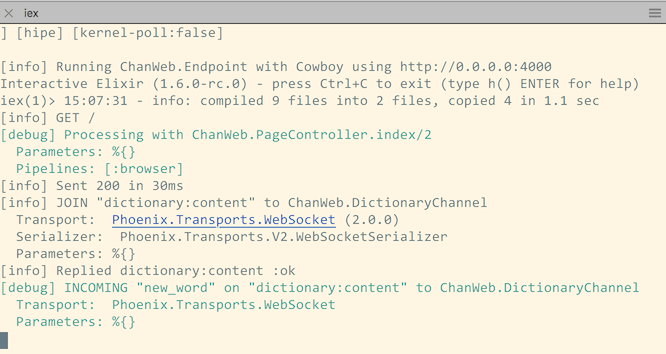
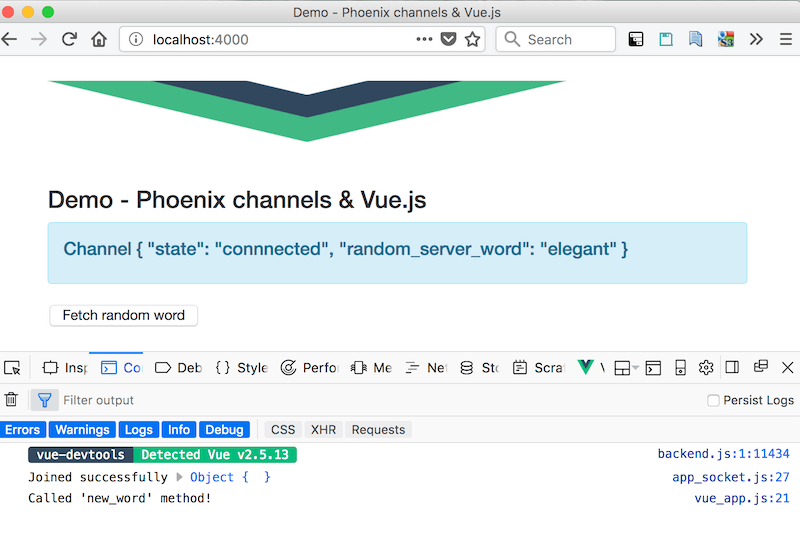
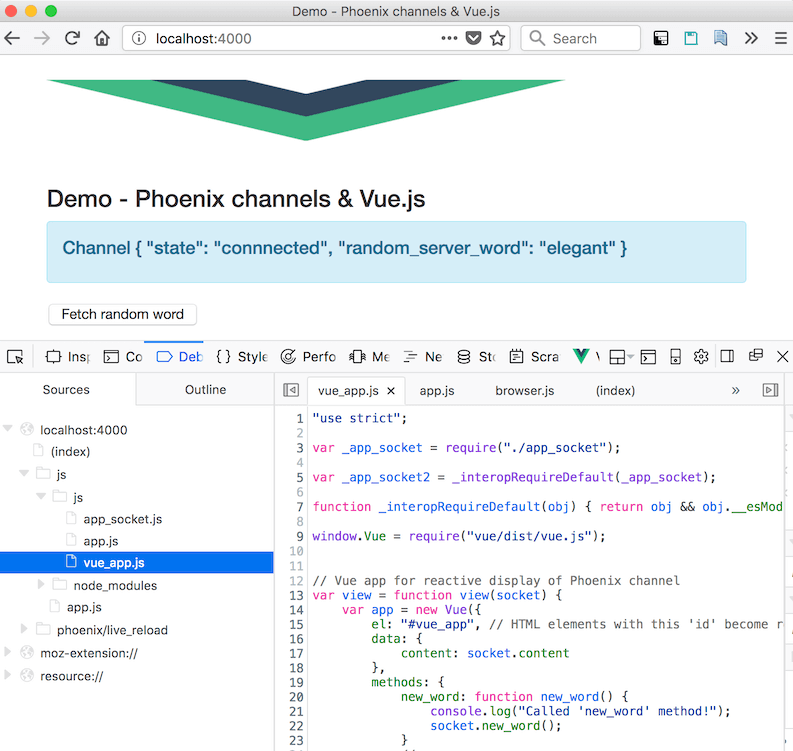
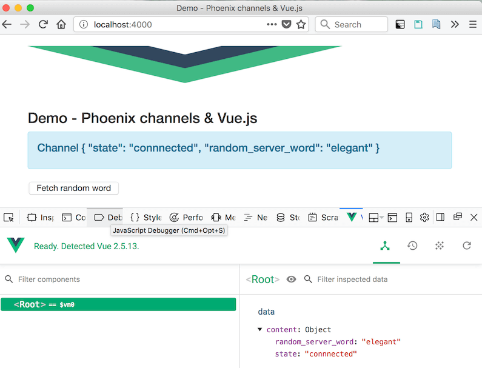

# Simple example of Phoenix and Vue.js integration

## Screen shots

 ### A browser somewhere just joined our Phoenix channel

   

  ### Its a Phoenix app using Vue.js

   

  ### A look at the Javascript injected by Phoenix

   

  ### Vue debugging tools work, too.

   

  Update 20180703: Phoenix project is now configured to use Webpack instead of Brunch. 
  
  When Phoenix 1.4 is released, Webpack will be default. I followed the gist below to configure Phoenix 1.3 and Webpack: https://gist.github.com/LostKobrakai/b28c18bc369f421cdc19136f8252b412).
  

